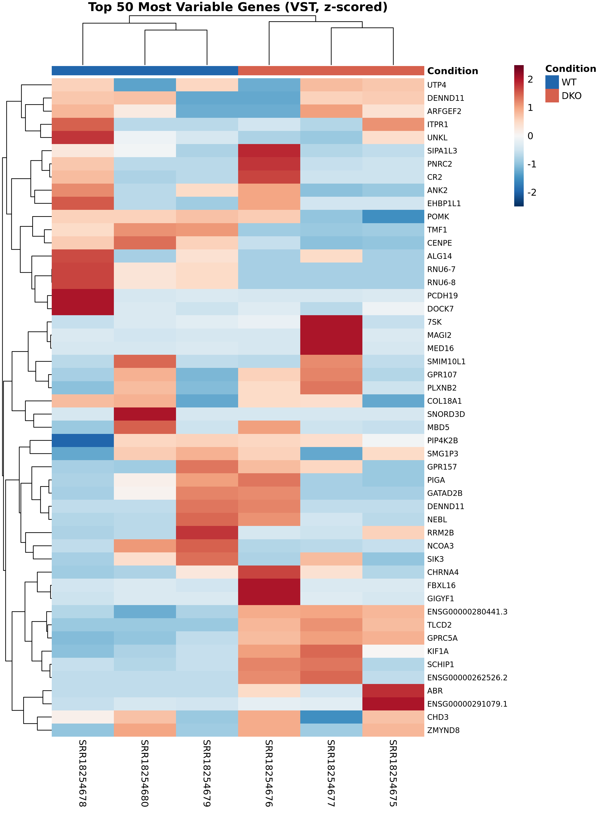

# ALKBH5/FTO Double Knockout — Bulk RNA-Seq Reproduction

> Independent reproduction of transcriptomic profiling from Smolin et al. (2022), *Data in Brief* — [doi:10.1016/j.dib.2022.108187](https://doi.org/10.1016/j.dib.2022.108187)

| Dataset | Accession |
|---|---|
| BioProject | [PRJNA813529](https://www.ncbi.nlm.nih.gov/bioproject/PRJNA813529) |
| GEO Series | [GSE198050](https://www.ncbi.nlm.nih.gov/geo/query/acc.cgi?acc=GSE198050) |

---

## Biological Background

The m⁶A (N⁶-methyladenosine) chemical modification is the most abundant internal modification on eukaryotic messenger RNA. It is dynamically regulated by "writer" complexes, "reader" proteins, and two primary "eraser" enzymes: **ALKBH5** and **FTO**. Knocking out both erasers simultaneously via CRISPR/Cas9 locks the transcriptome in a hyper-methylated state. This pipeline investigates the global transcriptional consequences of this permanent dysregulation in human HEK293T cells.

---

## Quick Start

```bash
# Option A: Single unified environment (recommended)
conda env create -f environment.yml
bash run_all.sh

# Option B: Run stages individually (see Execution Protocol below)
```

---

## Repository Structure

```text
bulk/
├── config/                  # Sample metadata
│   ├── design_matrix.csv    # Condition labels (WT vs DKO)
│   └── runinfo.csv          # SRA run info
├── scripts/                 # Pipeline stages (00–07)
│   ├── 00_resolve_metadata.sh
│   ├── 01_download_data.sh
│   ├── 02_run_qc.sh
│   ├── 03_download_reference.sh
│   ├── 04_build_salmon_index.sh
│   ├── 05_run_salmon_quant.sh
│   ├── 06_deseq2_analysis.R
│   └── 07_make_figures.R
├── data/                    # Raw fastq.gz reads (generated)
├── ref/                     # Reference genome & Salmon index (generated)
├── results/                 # Salmon quant & DESeq2 tables (generated)
├── figures/                 # Publication-ready plots (generated)
├── environment.yml          # Conda environment specification
├── run_all.sh               # One-command pipeline runner
├── reproduction_report.md   # Full scientific validation report
└── README.md
```

---

## Reproducibility Features

- **Single-Command Execution**: `bash run_all.sh` chains all 8 stages automatically.
- **Frozen Environment**: `environment.yml` pins exact tool versions for full reproducibility.
- **Disk-Safety Protocols**: Raw FASTQs are compressed with `pigz` immediately; SRA caches are purged after each sample. Heavy directories can be symlinked to secondary storage.
- **Strict Error Handling**: All shell scripts use `set -euo pipefail`; R scripts call `set.seed()` before stochastic operations.
- **Programmatic Accession Resolution**: SRR accessions are resolved via NCBI Entrez Direct, not hardcoded.
- **Ensembl Version Stripping**: Custom code strips transcript/gene version suffixes to prevent `tximport` ID mismatches.

---

## Execution Protocol

### 1. Setup Environment

```bash
# Unified environment (all tools in one env)
conda env create -f environment.yml

# Or set up three separate environments:
conda create -n rnaseq_bench_env -c bioconda sra-tools salmon -y
conda create -n QC_fastq -c bioconda fastqc multiqc -y
micromamba create -n r_deseq2 -c conda-forge -c bioconda \
  r-base bioconductor-deseq2 r-ggplot2 r-ggrepel r-pheatmap \
  r-rcolorbrewer bioconductor-tximport r-readr r-dplyr r-tibble \
  bioconductor-apeglm r-jsonlite -y
```

### 2. Run the Pipeline

```bash
# Full pipeline (single command)
bash run_all.sh

# Or run stages individually from scripts/:
cd scripts/
bash 00_resolve_metadata.sh
conda run -n rnaseq_bench_env bash 01_download_data.sh
conda run -n QC_fastq bash 02_run_qc.sh
bash 03_download_reference.sh
conda run -n rnaseq_bench_env bash 04_build_salmon_index.sh
conda run -n rnaseq_bench_env bash 05_run_salmon_quant.sh
conda run -n r_deseq2 Rscript 06_deseq2_analysis.R
conda run -n r_deseq2 Rscript 07_make_figures.R
```

> **Note**: If your system has less than 16 GiB RAM, set `FALLBACK_NO_DECOY=1` before running Stage 4 to build a transcriptome-only index instead of a full decoy-aware index.

---

## Results

### Per-Sample Quantification Summary

| SRR Accession | Condition | Library | Mapped Reads | Mapping Rate |
|---|---|---|---|---|
| SRR18254680 | WT | SR | 9,069,181 | 83.2% |
| SRR18254679 | WT | SR | 9,474,685 | 83.8% |
| SRR18254678 | WT | SR | 7,018,796 | 83.5% |
| SRR18254677 | DKO | SR | 7,812,281 | 84.7% |
| SRR18254676 | DKO | SR | 8,810,823 | 84.4% |
| SRR18254675 | DKO | SR | 8,090,430 | 84.0% |

### Differential Expression

Of the 22,797 genes passing the low-count filter, **502 are significantly differentially expressed** (padj < 0.05, |log₂FC| > 1):
- **352 upregulated** in DKO cells
- **150 downregulated** in DKO cells

The upregulation bias is biologically consistent: loss of both m⁶A erasers causes hyper-methylation, which can stabilize target mRNAs via disruption of YTHDF2-mediated decay pathways, leading to net increases in steady-state transcript levels.

### Figures

#### PCA Plot — Sample Segregation by Genotype


PC1 (33.9% variance) cleanly separates WT from DKO. Replicates cluster tightly within each group with no batch effects.

#### Volcano Plot — Genome-Wide Differential Expression


Apeglm-shrunk log₂ fold changes vs. −log₁₀(padj). Top DEGs are labeled. The distribution shows a clear upregulation bias consistent with m⁶A-mediated transcript stabilization.

#### Heatmap — Top 50 Most Variable Genes


Row-wise z-scored VST expression values. Hierarchical clustering perfectly partitions the 6 samples into WT and DKO branches.

---

## Tool Versions

| Tool | Version | Purpose |
|---|---|---|
| Salmon | 1.10.3 | Transcript quantification |
| sra-tools | 3.1.1 | FASTQ retrieval from NCBI SRA |
| FastQC | ≥0.12 | Per-sample read quality metrics |
| MultiQC | ≥1.35 | Aggregated QC reporting |
| DESeq2 | 1.50.2 | Differential expression analysis |
| tximport | 1.38.2 | Salmon-to-gene count aggregation |
| apeglm | 1.32.0 | Log₂ fold-change shrinkage |
| R | ≥4.5 | Statistical computing |
| Reference | Ensembl GRCh38 release 110 | Human transcriptome annotation |

---

## References

1. Smolin, E. A., Buyan, A. I., Lyabin, D. N., Kulakovskiy, I. V., & Eliseeva, I. A. (2022). *RNA-Seq data of ALKBH5 and FTO double knockout HEK293T human cells.* **Data in Brief**, 42, 108187. [doi:10.1016/j.dib.2022.108187](https://doi.org/10.1016/j.dib.2022.108187)
2. Patro, R., Duggal, G., Love, M. I., Irizarry, R. A., & Kingsford, C. (2017). Salmon provides fast and bias-aware quantification of transcript expression. *Nature Methods*, 14(4), 417–419.
3. Love, M. I., Huber, W., & Anders, S. (2014). Moderated estimation of fold change and dispersion for RNA-seq data with DESeq2. *Genome Biology*, 15(12), 550.
4. Zhu, A., Ibrahim, J. G., & Love, M. I. (2019). Heavy-tailed prior distributions for sequence count data: removing the noise and preserving large differences. *Bioinformatics*, 35(12), 2084–2092.
