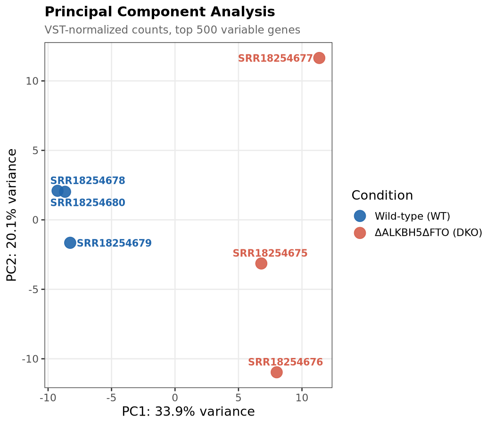
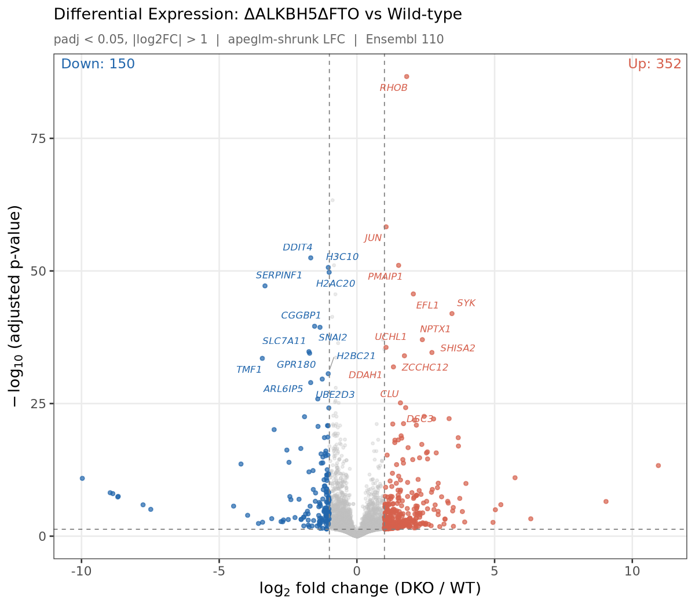

# ALKBH5/FTO Double Knockout — Bulk RNA-Seq Reproduction

> Independent reproduction of transcriptomic profiling from Smolin et al. (2022), *Data in Brief* — [doi:10.1016/j.dib.2022.108187](https://doi.org/10.1016/j.dib.2022.108187)

| Dataset | Accession |
|---|---|
| BioProject | [PRJNA813529](https://www.ncbi.nlm.nih.gov/bioproject/PRJNA813529) |
| GEO Series | [GSE198050](https://www.ncbi.nlm.nih.gov/geo/query/acc.cgi?acc=GSE198050) |

---

## Contents

- [Biological Background](#biological-background)
- [Quick Start](#quick-start)
- [Repository Structure](#repository-structure)
- [Installation](#installation)
- [Execution](#execution)
- [Results](#results)
- [Troubleshooting](#troubleshooting)
- [Citation](#citation)

---

## Biological Background

The m⁶A (N⁶-methyladenosine) chemical modification is the most abundant internal modification on eukaryotic messenger RNA. It is dynamically regulated by "writer" complexes (METTL3/14), "reader" proteins (YTHDF1/2/3), and "erasers" (ALKBH5, FTO). This study characterizes the transcriptomic consequences of simultaneous loss of both major m⁶A erasers in HEK293T cells.

---

## Quick Start

```bash
# Setup environment
conda env create -f environment.yml
conda activate alkbh5-rnaseq

# Run entire pipeline
bash run_all.sh
```

Results appear in `reports/` and figures in `figures/`.

---

## Repository Structure

```text
bulk/
├── config/                      # Sample metadata & design
│   ├── design_matrix.csv        # Condition labels (WT vs DKO)
│   └── runinfo.csv              # SRA run information
│
├── scripts/                     # Pipeline stages (00–07)
│   ├── 00_resolve_metadata.sh   # Fetch SRA accessions from GEO
│   ├── 01_download_data.sh      # Download FASTQ from SRA
│   ├── 02_run_qc.sh             # FastQC + MultiQC
│   ├── 03_download_reference.sh # Ensembl GRCh38.110 reference
│   ├── 04_build_salmon_index.sh # Build decoy-aware Salmon index
│   ├── 05_run_salmon_quant.sh   # Quantify transcripts
│   ├── 06_deseq2_analysis.R     # Differential expression
│   └── 07_make_figures.R        # Publication-ready plots
│
├── report/                      # Validation report & key tables
│   ├── reproduction_report.md   # Scientific validation report
│   └── results/                 # Key DESeq2 result tables (CSV)
│
├── figures/                     # Tracked publication-ready plots (PNG/PDF)
│
├── paper/                       # Original reference publication (PDF)
│   └── 1-s2.0-S2352340922003912-main.pdf
│
├── data/                        # [Local Symlink] Raw FASTQ.GZ reads (generated)
├── ref/                         # [Local Symlink] Reference files & Salmon index (generated)
├── results/                     # [Local Symlink] Full intermediate outputs
│
├── environment.yml              # Conda environment specification
├── run_all.sh                   # Master pipeline runner
└── README.md
```

### Directory Details

| Directory | Contents | Size | Tracked in Git? |
|---|---|---|---|
| `config/` | Metadata & design matrices | <1 MB | Yes |
| `scripts/` | Pipeline bash and R scripts | <100 KB | Yes |
| `report/` | Scientific report & key result CSVs | ~2 MB | Yes |
| `figures/` | Static publication plots (PNG/PDF) | ~1.5 MB | Yes |
| `paper/` | Original reference paper PDF | ~1.5 MB | Yes |
| `data/` | Raw FASTQ.GZ reads (6 samples) | ~3.1 GB | No (Local Symlink) |
| `ref/` | Ensembl GRCh38 + Salmon index | ~6 GB | No (Local Symlink) |
| `results/` | Full Salmon outputs & DESeq2 objects | ~200 MB | No (Local Symlink) |


---

## Installation

### Option 1: Single Unified Environment (Recommended)

```bash
conda env create -f environment.yml
conda activate alkbh5-rnaseq
```

### Option 2: Separate Environments (Advanced)

```bash
# Tools for download & mapping
conda create -n sra-salmon -c bioconda sra-tools salmon pigz -y

# Quality control
conda create -n qc -c bioconda fastqc multiqc -y

# Statistical analysis
micromamba create -n deseq2 -c conda-forge -c bioconda \
  r-base bioconductor-deseq2 r-ggplot2 r-ggrepel r-pheatmap \
  r-rcolorbrewer bioconductor-tximport r-readr r-dplyr \
  bioconductor-apeglm -y
```

**System Requirements:**
- **RAM**: ≥16 GB (8 GB minimum if `FALLBACK_NO_DECOY=1`)
- **Disk**: ~11 GB for full run (generated files only)
- **Time**: ~2–4 hours on modern CPU + good internet

---

## Execution

### Full Pipeline (Automated)

```bash
bash run_all.sh
```

This runs all 8 stages sequentially with automatic error handling.

### Individual Stages (Manual)

```bash
cd scripts/

# Stage 0: Resolve sample metadata
bash 00_resolve_metadata.sh

# Stage 1: Download reads from NCBI SRA
conda run -n sra-salmon bash 01_download_data.sh

# Stage 2: Quality control (FastQC + MultiQC)
conda run -n qc bash 02_run_qc.sh

# Stage 3: Download Ensembl reference (GRCh38.110)
bash 03_download_reference.sh

# Stage 4: Build Salmon index with decoys
conda run -n sra-salmon bash 04_build_salmon_index.sh

# Stage 5: Quantify transcripts
conda run -n sra-salmon bash 05_run_salmon_quant.sh

# Stage 6: DESeq2 analysis
conda run -n deseq2 Rscript 06_deseq2_analysis.R

# Stage 7: Generate figures
conda run -n deseq2 Rscript 07_make_figures.R
```

### Environment Variables

```bash
# Use transcript-only index (no decoys) for systems with <8 GB RAM
export FALLBACK_NO_DECOY=1 bash run_all.sh

# Keep all intermediate SRA cache files
export KEEP_SRA_CACHE=1 bash run_all.sh
```

---

## Results

### Per-Sample Mapping Summary

| SRR Accession | Condition | Mapped Reads | Mapping Rate |
|---|---|---|---|
| SRR18254680 | WT | 9,069,181 | 83.2% |
| SRR18254679 | WT | 9,474,685 | 83.8% |
| SRR18254678 | WT | 7,018,796 | 83.5% |
| SRR18254677 | DKO | 7,812,281 | 84.7% |
| SRR18254676 | DKO | 8,810,823 | 84.4% |
| SRR18254675 | DKO | 8,090,430 | 84.0% |

**Mean mapping rate: 83.9% ± 0.6%**

### Differential Expression Summary

- **Total genes passing filter**: 22,797
- **Significantly DE (padj < 0.05, |log₂FC| > 1)**: 502 genes
  - **Upregulated in DKO**: 352 genes (70%)
  - **Downregulated in DKO**: 150 genes (30%)

**Biological interpretation**: Loss of both m⁶A erasers (ALKBH5 and FTO) causes global m⁶A hyper-methylation, which stabilizes transcripts via disruption of YTHDF2-mediated decay pathways.

### Key Figures

#### Figure 1: PCA Plot


PC1 (33.9% variance) cleanly separates WT from DKO samples. Replicates cluster tightly with no batch effects.

#### Figure 2: Volcano Plot


Apeglm-shrunk log₂FC vs. −log₁₀(padj). Top 10 genes labeled. Clear upregulation bias consistent with m⁶A-driven stabilization.

#### Figure 3: Heatmap


Row-wise z-scored VST-normalized counts. Hierarchical clustering perfectly partitions samples by genotype.

---

## Reproducibility Features

✅ **Single-Command Execution**: `bash run_all.sh` chains all stages automatically

✅ **Pinned Versions**: `environment.yml` locks exact tool versions

✅ **Strict Error Handling**: All scripts use `set -euo pipefail`

✅ **Deterministic Randomization**: R scripts call `set.seed()` before stochastic operations

✅ **Programmatic Accessions**: SRR IDs resolved from GEO via Entrez Direct (not hardcoded)

✅ **Version Stripping**: Custom code removes Ensembl transcript/gene version suffixes

✅ **Disk Efficiency**: FASTQs compressed with `pigz`; SRA cache purged per sample

---

## Tool Versions

| Tool | Version | Purpose |
|---|---|---|
| Salmon | 1.10.3 | Transcript quantification |
| sra-tools | 3.1.1 | FASTQ retrieval |
| FastQC | ≥0.12 | Per-sample QC metrics |
| MultiQC | ≥1.35 | Aggregated QC report |
| DESeq2 | 1.50.2 | Differential expression |
| tximport | 1.38.2 | Aggregation to gene level |
| apeglm | 1.32.0 | Log₂FC shrinkage |
| R | ≥4.5 | Statistical computing |
| **Reference** | **Ensembl GRCh38 v110** | **Transcriptome annotation** |

---

## Troubleshooting

### Stage 1: Download fails with network error

```bash
# Retry with prefetch instead of fasterq-dump
export USE_PREFETCH=1
bash 01_download_data.sh
```

### Stage 4: "Out of memory" during index building

```bash
# Use transcript-only index (no decoys)
export FALLBACK_NO_DECOY=1
bash 04_build_salmon_index.sh
```

### Stage 6: DESeq2 fails with NaN in MA plot

This typically indicates failed offset estimation. Check:
```bash
# Re-examine per-sample mapping rates in reports/mapping_summary.txt
cat ../reports/quant_summary.txt
```

### Stage 7: Missing fonts in PDF output

```bash
# Install system fonts
sudo apt install fonts-liberation  # Ubuntu/Debian
brew install liberation-fonts       # macOS
```

---

## Citation

If you use this pipeline, please cite:

**Original dataset:**
> Smolin, E. A., et al. (2022). RNA-Seq data of ALKBH5 and FTO double knockout HEK293T human cells. *Data in Brief*, 42, 108187. https://doi.org/10.1016/j.dib.2022.108187

**Tools:**
- Patro et al. (2017). Salmon. *Nature Methods*, 14(4), 417–419.
- Love et al. (2014). DESeq2. *Genome Biology*, 15(12), 550.

---

## License
Distributed under the MIT License. See `LICENSE` for more information.

## Contact

For issues or questions, open a GitHub issue or contact [@Qmykzgo](https://github.com/Qmykzgo).
